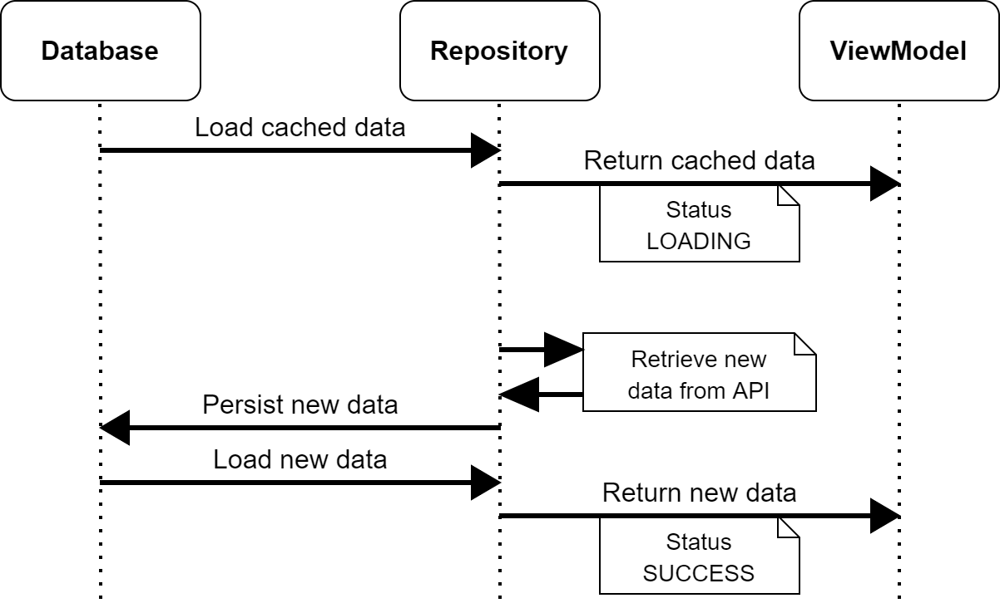
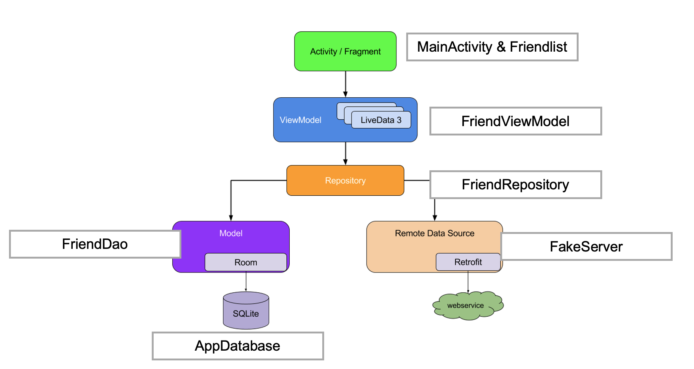

# Android Architecture Example

## Project Setup

1. Clone
1. Change Gradle's JDK Settings (if not already set as default): 
`Preferences > Build, Execution, Deployment > BuildTools > Gradle > Gradle JDK > 11`

## Preamble & Disclaimer

This **Android Architecture Example** is provided by researchers from [INSO](https://www.inso.tuwien.ac.at/) & [DECO](https://deco.inso.tuwien.ac.at/) to illustrate a possible draft for a basic Android architecture. The goal of this project is to give an overview to important concepts of the Android SDK and its related components. Software architectures differ, are constantly evolving and always depend on the context and requirements of a software. Therefore, this projects can only be seen as proposal to build upon and does **not** aspire to be complete nor perfect.

## Focus and Context

This Android project was implemented as a basis for a live coding session at the [Technische Universität Wien](https://www.tuwien.at/en/) in [183.661 Mobile (App) Software Engineering](https://tiss.tuwien.ac.at/course/educationDetails.xhtml?dswid=2813&dsrid=201&courseNr=183661). Two live coding sessions use this project as a basis: Architecture & UI. Focus lies on introducing the following concepts:

Architecture: 

* [Android Studio](https://developer.android.com/studio/)
* [Android Resources and Localization](https://developer.android.com/guide/topics/resources/providing-resources)
* [Gradle Build Tools](https://gradle.org/) and [Dependency handling](https://developer.android.com/studio/build/dependencies)
* [MVVM Architecture](https://developer.android.com/jetpack/guide) and [Repository Pattern](https://developer.android.com/jetpack/guide#overview)
* [Room Database](https://developer.android.com/training/data-storage/room)
* Dependency Injection with [Koin](https://insert-koin.io/)
* [Structured Concurrency with Kotlin Coroutines](https://developer.android.com/kotlin/coroutines)
* [ViewModels](https://developer.android.com/topic/libraries/architecture/viewmodel), Android Lifecycle and [Reactive Programming](https://en.wikipedia.org/wiki/Reactive_programming).

UI
* [Jetpack Compose](https://developer.android.com/jetpack/compose/documentation)
* User Interface Design
* Resources (Strings, Images, Icons)

## Project Overview & Architecture

The project uses `Friend` as a Model to illustrate on how to access the database and an API. The focus lies on the architecture and how these different asynchronous operations can be combined within a [Repository Pattern](https://developer.android.com/jetpack/guide#overview).

Friends are "downloaded" from a fake server and then saved to the database which triggers a stream of data to update the user interface.

### Dataflow within the application

<br />



<br />

### Repository Pattern with respective Classes

<br />



<br />

### Screenshot

<br />


<br />
<br />

## Further Resources for Android Developers

* [KtLint](https://github.com/pinterest/ktlint) – Lint Checker to write properly formatted code
* Bug Tracking with e.g. [Sentry](https://sentry.io/welcome/)
* Continuous Localization with e.g. [Weblate](https://weblate.org/en/)
* [Retrofit](https://square.github.io/retrofit/) – A type-safe HTTP client for Android.
* [Glide](https://github.com/bumptech/glide) – a fast and efficient open source media management and image loading framework for Android
* [Robolectric](http://robolectric.org/androidx_test/) for testing android applications
* Network interception tools for debugging and testing e.g. [mitmproxy](https://mitmproxy.org/) or [Proxyman](https://proxyman.io/)
* [Material Design resources](https://material.io/) such as [theming](https://material.io/design/guidelines-overview) or [icons](https://fonts.google.com/icons?selected=Material+Icons)
* Use [Scrcpy](https://github.com/Genymobile/scrcpy) to mirror and control your Android device from a desktop computer
* [Hilt](https://developer.android.com/training/dependency-injection/hilt-android) – another dependency injection framework by Google
* [Firebase Cloud-Messaging](https://firebase.google.com/docs/cloud-messaging/)
* Finding memory leaks with [LeakCanary](https://github.com/square/leakcanary)
* [Android Arsenal](https://android-arsenal.com/) - Search base for Android libraries
* Improved logging with [Timber](https://github.com/JakeWharton/timber)

## Authors in Alphabetic Order

* Christian Schuhmacher
* Clemens Kößler
* Gabriel Sperrer
* [Paul Spiesberger](https://spiesberger.eu/)
* [Michael Wapp](https://michaelwapp.com/)  
* Richard Schlögl
* Stefan Bachl

<br />


<br />
<br />

## Licence

```
MIT License

Copyright (c) 2022 INSO & DECO – https://www.inso.tuwien.ac.at/

Permission is hereby granted, free of charge, to any person obtaining a copy
of this software and associated documentation files (the "Software"), to deal
in the Software without restriction, including without limitation the rights
to use, copy, modify, merge, publish, distribute, sublicense, and/or sell
copies of the Software, and to permit persons to whom the Software is
furnished to do so, subject to the following conditions:

The above copyright notice and this permission notice shall be included in all
copies or substantial portions of the Software.

THE SOFTWARE IS PROVIDED "AS IS", WITHOUT WARRANTY OF ANY KIND, EXPRESS OR
IMPLIED, INCLUDING BUT NOT LIMITED TO THE WARRANTIES OF MERCHANTABILITY,
FITNESS FOR A PARTICULAR PURPOSE AND NONINFRINGEMENT. IN NO EVENT SHALL THE
AUTHORS OR COPYRIGHT HOLDERS BE LIABLE FOR ANY CLAIM, DAMAGES OR OTHER
LIABILITY, WHETHER IN AN ACTION OF CONTRACT, TORT OR OTHERWISE, ARISING FROM,
OUT OF OR IN CONNECTION WITH THE SOFTWARE OR THE USE OR OTHER DEALINGS IN THE
SOFTWARE.
```
