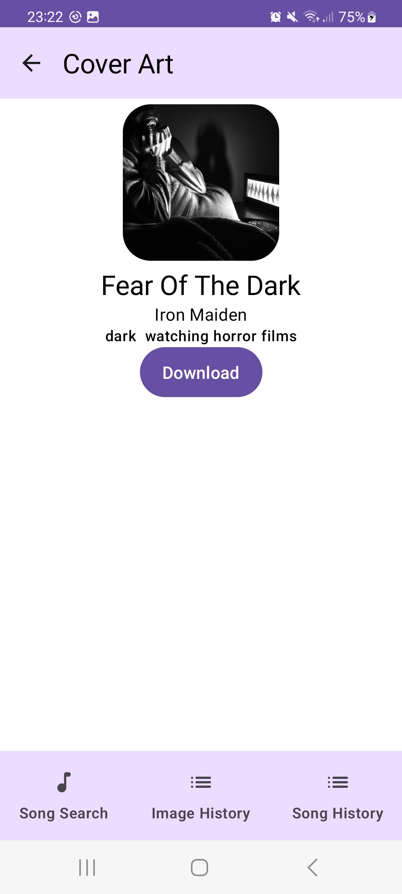

# SoundView
## Project Setup

1. Clone
1. Change Gradle's JDK Settings (if not already set as default): 
`Preferences > Build, Execution, Deployment > BuildTools > Gradle > Gradle JDK > 11`

## Instructions
1. Allow permissions if required.
2. Scan a song, wait 10 seconds for result.
3. If song was found, click on the song card.
4. Wait for lyrics to appear and click "Go" or change keywords in the input field.
5. Wait for images to download. Should take around 5 seconds.
6. Select an image, click download. 
7. The image will be saved in the pictures folder. The song will be added to the app's database, as well as the images generated based on it.

## Preamble & Disclaimer

This **Android Application** is provided by Alen Bisanovic and Vlad Popescu-Vifor. The goal of this project is to create an innovative app by applying important concepts of the Android SDK and its related components in combination with several API's. 

## Project Overview & Architecture

The main goal of our app is generating an AI illustration that would match the lyrics of a song.
Our concept of the app would be having the phone listen to a song, obtain its name using AudD , then use the name to obtain the lyrics of the song using the lyrics API. Afterwards, NLP would be applied on the lyrics for the most important words found in the text. These words would then be entered into the DALL-E API, which will generate an AI image based on those words. 
Additionally, the user will also be able to view a history of the generated images and save them to the local storage of the mobile phone. Another important feature is manually entering a song name  and viewing its lyrics, as well as NLP statistics based on the text. A history of the previous scanned songs would also be available for the user to re-select. 

### Architecture: 

* [Android Studio](https://developer.android.com/studio/)
* [Android Resources and Localization](https://developer.android.com/guide/topics/resources/providing-resources)
* [Gradle Build Tools](https://gradle.org/) and [Dependency handling](https://developer.android.com/studio/build/dependencies)
* [MVVM Architecture](https://developer.android.com/jetpack/guide) and [Repository Pattern](https://developer.android.com/jetpack/guide#overview)
* [Room Database](https://developer.android.com/training/data-storage/room)
* Dependency Injection with [Koin](https://insert-koin.io/)
* [Structured Concurrency with Kotlin Coroutines](https://developer.android.com/kotlin/coroutines)
* [ViewModels](https://developer.android.com/topic/libraries/architecture/viewmodel), Android Lifecycle and [Reactive Programming](https://en.wikipedia.org/wiki/Reactive_programming).

### UI
* [Jetpack Compose](https://developer.android.com/jetpack/compose/documentation)
* User Interface Design
* Resources (Strings, Images, Icons)

### Dataflow within the application - coming soon
 

### Screenshots 

## Authors in Alphabetic Order

* Alen Bisanovic 
* Vlad Popescu-Vifor

